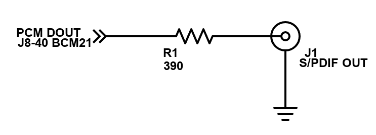

# RASPDIF
S/PDIF audio output on Raspberry Pi (3B) without a HAT.

raspdf reads 16 bit PCM samples from stdin, encodes and transmit S/PDIF data on GPIO21 (Pin 40 on J8).

## Prerequisits
* clang - Tested against `clang version 3.8.1-24+rpi1`

## Building
Just run make. No install target yet.
```
make
```

## Usage
Use ffmpeg to decode any audio file to the proper format and pipe to raspdif. Root is required to access the RPi peripherals via memmap.
```
ffmpeg  -i some_audio_file.flac -f s16le -acodec pcm_s16le - | sudo ./build/raspdif
```

## Signal Levels
S/PDIF specification calls for .5 V Vpp when 75 Ohm is connected across the output. To achieve these level from the RPi's nominal 3.3 V signaling a simple resisitve divider can be build with a 390 Ohm resister is series with the output.



However, my DAC and receiver have not had an issue receiving the full 3.3 V signal. Use at your own risk.